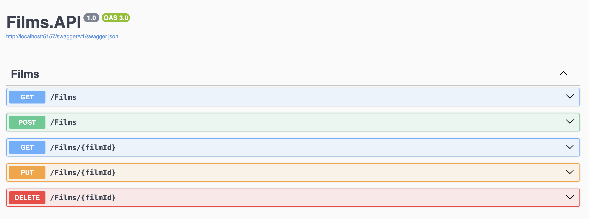
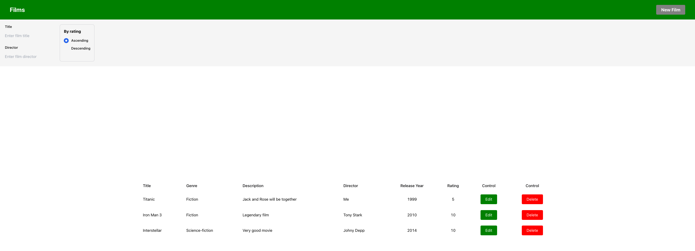
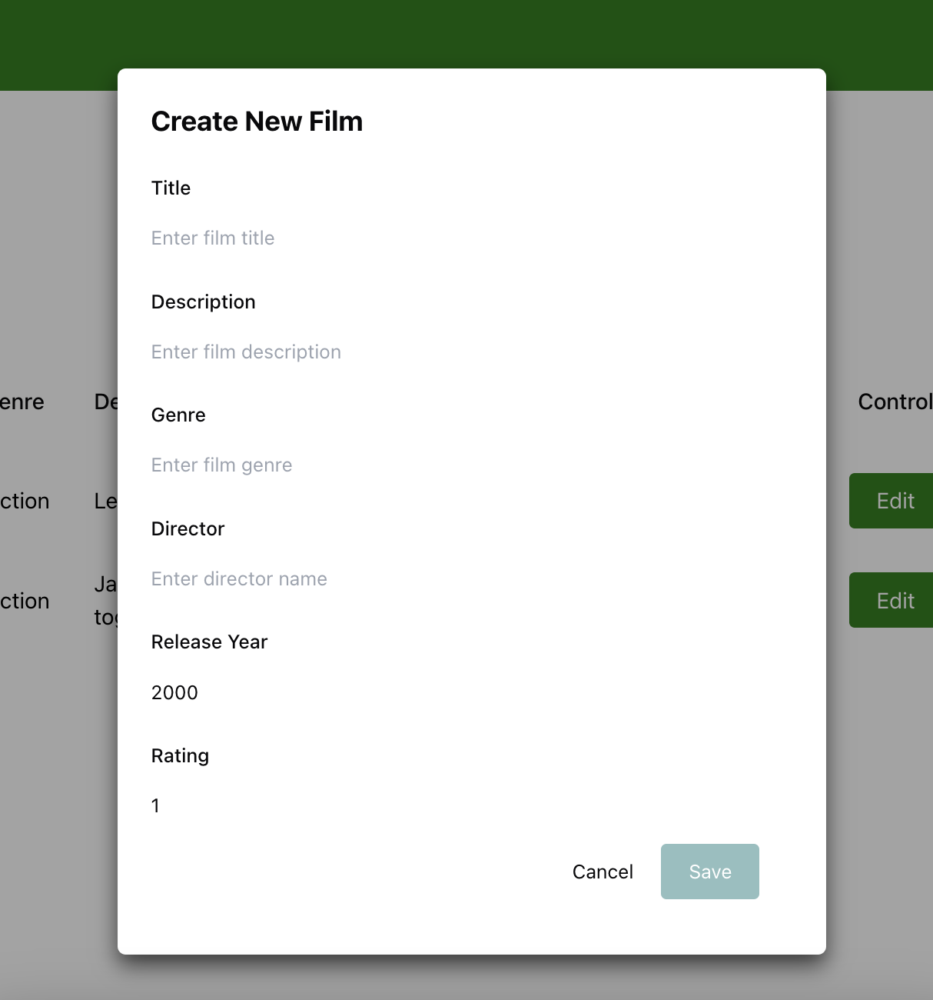
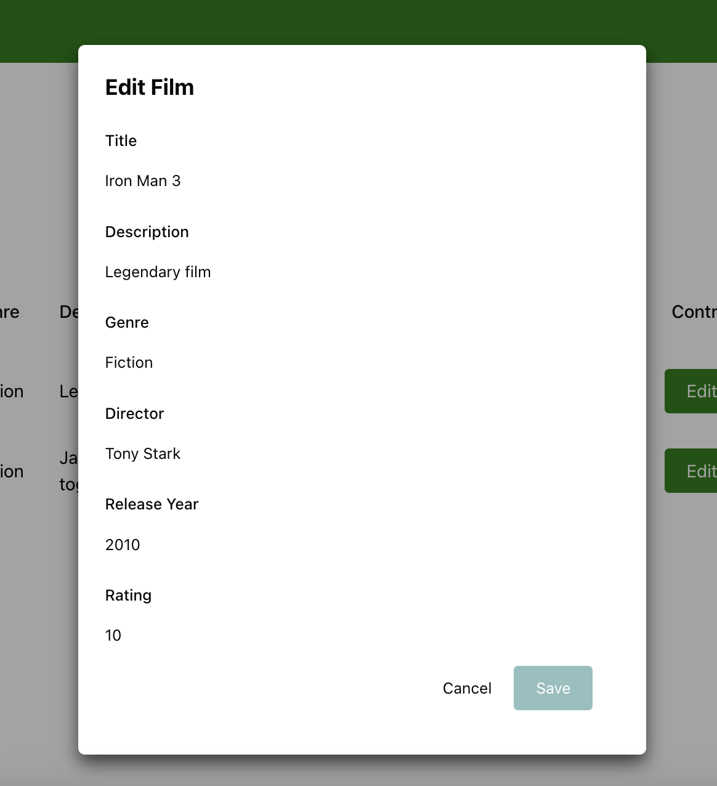
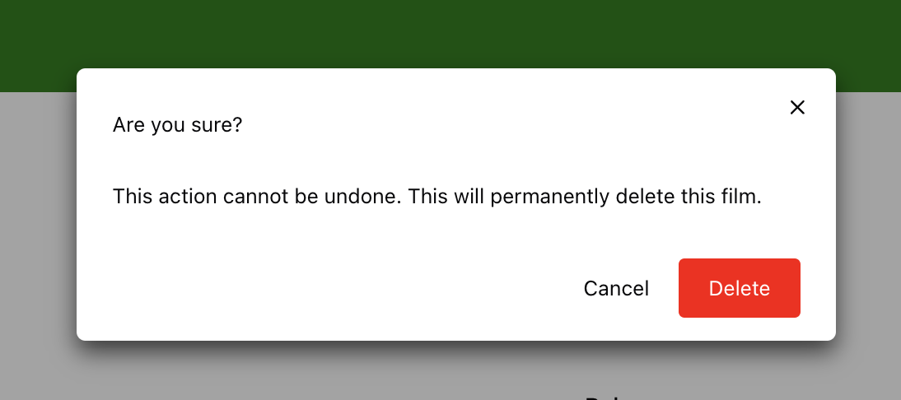

# Films Management

A test project that uses **ASP.NET Core Web API** as backend and **React** as frontend and processes users' favourite films. It uses **PostgreSQL** as the database.

---

## Table of Contents

- [Films Management](#films-management)
  - [Table of Contents](#table-of-contents)
  - [Overview](#overview)
    - [Example User Flow](#example-user-flow)
  - [Requirements](#requirements)
  - [Setup](#setup)
    - [Clone the repository](#clone-the-repository)
  - [Environment variables setup](#environment-variables-setup)
    - [1. Backend](#1-backend)
    - [2. Frontend](#2-frontend)
  - [Running the project](#running-the-project)
    - [Running the backend (ASP.NET Core Web API)](#running-the-backend-aspnet-core-web-api)
    - [Running the frontend (React)](#running-the-frontend-react)
  - [Project structure](#project-structure)
    - [backend/:](#backend)
    - [frontend/:](#frontend)

## Overview

When you open the app, the homepage displays a list of films with the following features:

1. **Film List**:
   - The homepage shows a list of movies;
   - Users can scroll through the list to explore available movies.

2. **Film Actions**:
   - Each movie has options to:
     - **Edit**: Opens a form where you can modify the film's details, such as the title, description, genre, etc;
     - **Delete**: Permanently removes the film from the collection.

3. **Adding a New Film**:
   - The top navigation bar contains a button labeled **"New Film"**.
   - Clicking the "New Film" button opens a form where users can add a new movie to the collection by providing:
     - Title
     - Description
     - Genre
     - Director
     - Release Year
     - Rating

### Example User Flow
---

>1. **Swagger**:



>2. **Homepage**:

  

>3. **Adding a Film**:



>4. **Editing a Film**:



>5. **Deleting a Film**:



## Requirements

Make sure the following tools are installed on your machine:

- [Node.js](https://nodejs.org/) (v16 or later)
- [npm](https://www.npmjs.com/) or [yarn](https://yarnpkg.com/)
- [Visual Studio](https://visualstudio.microsoft.com/) (with **ASP.NET and web development** installed)
- [PostgreSQL](https://www.postgresql.org/) (v12 or later)
- [Git](https://git-scm.com/)


## Setup

### Clone the repository

Clone the repository to your machine:

```bash
git clone https://github.com/vanyachernov/NetCoreFilms.git

cd ./NetCoreFilms
```

## Environment variables setup

To configure the environment variables for the backend and frontend, follow these steps:

### 1. Backend

- Navigate to the backend directory:

```bash
cd ./backend
```

- Copy the .env.example file to create your own .env file:

```bash
cp .env.example .env
```

### 2. Frontend

- Navigate to the frontend directory:

```bash
cd ../frontend
```

Copy the .env.example file to create your own .env file just like you did in the backend.

## Running the project

### Running the backend (ASP.NET Core Web API)

- Restore dependencies:

```bash
dotnet restore
```

- Apply database migrations:

```bash
dotnet ef database update
```

- Start the development server:

```bash
dotnet run
```

### Running the frontend (React)

- Install dependencies:

```bash
npm install
# or
yarn install
```

- Start the development server:

```bash
npm start
# or
yarn start
```

**I'm sure you can do it!** 🙃

## Project structure
### backend/:
>The backend, built with ASP.NET Core Web API. Handles requests, manages the PostgreSQL database, and provides APIs for films management.
### frontend/:
>The frontend, built with React. Interacts with the API to display data and provide functionality (CRUD operations).